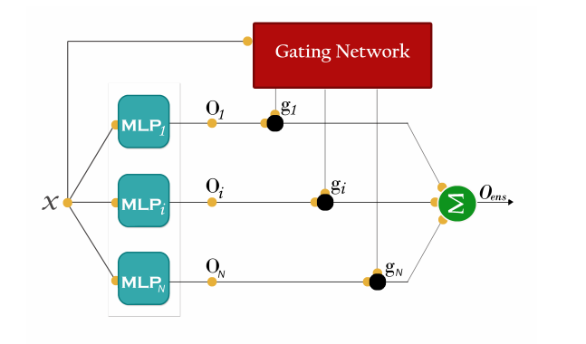
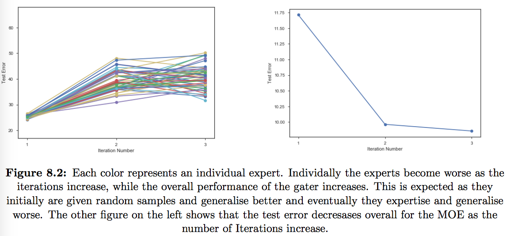
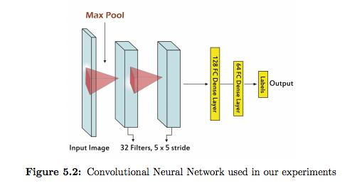
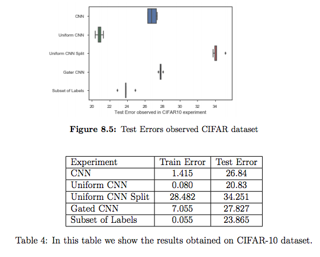

# Mixture Of Experts (MoE)
Mixture of Experts (MoE) is a classical architecture for ensembles where each member is specialised in a given part of the input space or its expertise area. Working in this manner, we aim to specialise the experts on smaller problems, solving the original problem through some type of divide and conquer approach.

My master thesis report can be found [here](https://github.com/krishnakalyan3/MixtureOfExperts/blob/master/kalyan_thesis.pdf).

### [Reproducing Collabert et al.](https://papers.nips.cc/paper/1949-a-parallel-mixture-of-svms-for-very-large-scale-problems.pdf)
In the paper the author proposes and new approch to scale SVM (almost linear time) as the number of examples increase. SVMs dont scale as the number of examples incerease.

- Benchmark dataset : Forest
- Change to binary classification problem
- Parameter of the kernel is chosen by cross validation
- Cost function mean square error
- Termination Condition : Validation Error goes up or Number of iterations
- [Configuration](https://github.com/krishnakalyan3/Scripts/blob/master/Thesis/logs/forest.txt)
- [Notebook](https://github.com/krishnakalyan3/Scripts/blob/master/Thesis/notebooks/Forest.ipynb)
- [Code](https://github.com/krishnakalyan3/MixtureOfExperts/tree/master/code/forest)
- [Grid Search Results](https://github.com/krishnakalyan3/MixtureOfExperts/tree/master/forest_gs.md)

SNo.| Experiment | Train Error | Test Error | Seq| Par | Comments
--- | --- | --- | --- | --- | --- | ---
1 | One MLP | 11.72 | 14.43 | [13](https://github.com/krishnakalyan3/Scripts/blob/master/Thesis/logs/forest_single_mlp.txt) |  | 
2 | One SVM | 9.85 | 11.50 | [25](https://github.com/krishnakalyan3/Scripts/blob/master/Thesis/logs/forest_single_svm.txt) |  |  
3 | Unifrom SVM | 16.98 | 17.65 | [15](https://github.com/krishnakalyan3/Scripts/blob/master/Thesis/logs/forest_uniform_seq_svm.txt) | [10](https://github.com/krishnakalyan3/Scripts/blob/master/Thesis/logs/forest_uniform_parallel_svm.txt)|  | 
4 | Gater | 4.94 | 9.54| [140](https://github.com/krishnakalyan3/Scripts/blob/master/Thesis/logs/forest_gater_seq_verbose.txt) |[64](https://github.com/krishnakalyan3/Scripts/blob/master/Thesis/logs/forest_gater_par_bias_1.txt) | Seq has verbose info, timing might be longer as it has verbose info
5 | Gater MLP | 17.27 | 17.66 | [137](https://github.com/krishnakalyan3/Scripts/blob/master/Thesis/logs/forest_gater_mlp.txt) | 

## Multiclass MLPs
Now we replace our experts with MLP. We use a modified version of LeNet as described below.

## Datasets
Dataset used in our experiments can be seen below.

## Results for CIFAR10
We consider Uniform CNN split as our baseline since since each expert gets 1/10 of the data. Uniform CNN as out gold standard as all expoers get all the data
. Our MOE do suprising well on our data set even when these expert only recieve 1/10 of the data.

# Conclusion
We already highlighted the need for more data to train experts. For MLP as experts we observed convergence within 3 iterations mostly. Also Plot 8.3 showed us there is almost a linear decrease in error as the number of training observations increase. Despite these issues we observe that our MoE and subset of labels have a comparable performance to uniform ensemble of CNN trained on complete data. Subset of labels does a better job than MoE in all the experiments because of the advantage of having more data.
